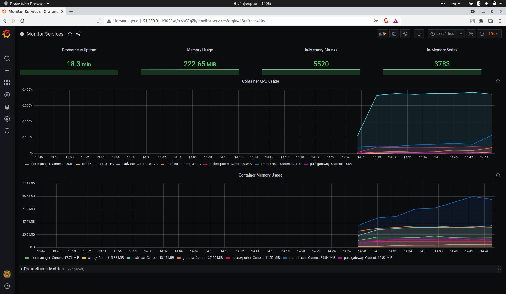

# Домашнее задание к занятию "5.4. Оркестрация группой Docker контейнеров на примере Docker Compose". Packer + Terraform + Ansible + Docker.
На YandexCloud создание Production сервиса на
примере Prometheus, Grafana, Alert manager, Push gateway,
Node exporter, cAdvicor, Caddy.

## Как сдавать задания

Обязательными к выполнению являются задачи без указания звездочки. Их выполнение необходимо для получения зачета и диплома о профессиональной переподготовке.

Задачи со звездочкой (*) являются дополнительными задачами и/или задачами повышенной сложности. Они не являются обязательными к выполнению, но помогут вам глубже понять тему.

Домашнее задание выполните в файле readme.md в github репозитории. В личном кабинете отправьте на проверку ссылку на .md-файл в вашем репозитории.

Любые вопросы по решению задач задавайте в чате учебной группы.

---

## Задача 1

Создать собственный образ операционной системы с помощью Packer.

Для получения зачета, вам необходимо предоставить:
- Скриншот страницы, как на слайде из презентации (слайд 37).

### Ответ:
```
#Устанавливаем Packer на ubuntu. Другие варианты установки на сайте https://www.packer.io/downloads
curl -fsSL https://apt.releases.hashicorp.com/gpg | sudo apt-key add -
sudo apt-add-repository "deb [arch=amd64] https://apt.releases.hashicorp.com $(lsb_release -cs) main"
sudo apt-get update && sudo apt-get install packer

#Устанавливаем Terraform на ubuntu. Другие варианты установки на сайте https://www.terraform.io/downloads
curl -fsSL https://apt.releases.hashicorp.com/gpg | sudo apt-key add -
sudo apt-add-repository "deb [arch=amd64] https://apt.releases.hashicorp.com $(lsb_release -cs) main"
sudo apt-get update && sudo apt-get install terraform
```
```
#Интерфейс командной строки Yandex.Cloud (CLI). Скрипт установит CLI и добавит путь до исполняемого файла в переменную окружения PATH.
curl https://storage.yandexcloud.net/yandexcloud-yc/install.sh | bash
```

Запрос токена для авторизации.
https://cloud.yandex.ru/docs/iam/concepts/authorization/oauth-token

```
# Инициализация сети
yc vpc network create \
--name net \
--labels my-label=netology \
--description "my first network via yc"

# Инициализация подсети
yc vpc subnet create \
--name my-subnet-a \
--zone ru-central1-a \
--range 10.1.2.0/24 \
--network-name net \
--description "my first subnet via yc"
```
```
# Проверка версии Packer, корректности конфигурации и запуск сборки
$ packer --version
1.7.9
packer validate centos-7-base.json
packer build centos-7-base.json

#просмотр доступных образов
yc compute image list
```
```
#удаляем сеть и подсеть, если не нужна. Что бы не платить ни за что.
yc vpc subnet selete --name my-subnet-a && yc vpc network delete --name net
```

<p align="center">
  
</p>

## Задача 2

Создать вашу первую виртуальную машину в Яндекс.Облаке.

Для получения зачета, вам необходимо предоставить:
- Скриншот страницы свойств созданной ВМ, как на примере ниже:

<p align="center">
  
</p>

### Ответ:
```
#устанавливаем terraform. Сcылка выше.
terraform -version
Terraform v1.1.4
on linux_amd64

# Переходим в директорую с terraform 
cd Virt-homeworks//05-virt-04-docker-compose/src/terraform

# Запускаем инициализацию. Скачивает последнюю версию плагина yandex облака.
terraform init
Initializing the backend...
Initializing provider plugins...
- Installing yandex-cloud/yandex v0.70.0...

#создаем ключ SSH
ssh-keygen -t rsa

# С плюсом (+) будет показано, что будет установленно.
terraform plan

#запускаем процесс сборки
terraform apply
```
<p align="center">
  
</p>


## Задача 3

Создать ваш первый готовый к боевой эксплуатации компонент мониторинга, состоящий из стека микросервисов.

Для получения зачета, вам необходимо предоставить:
- Скриншот работающего веб-интерфейса Grafana с текущими метриками, как на примере ниже
<p align="center">
  
</p>

### Ответ:
```
В файл inventory в asible_host добавляем внешний IP.
Virt-homeworks/05-virt-04-docker-compose/src/ansible/inventory

node01.netology.cloud ansible_host=51.250.0.11

# Переходим в папку с ansible
Virt-homeworks/05-virt-04-docker-compose/src/ansible

# Запускаем команду
ansible-playbook provision.yml

Заходим на публичный адрес на порт 3000
http://51.250.0.11:3000/
```
<p align="center">
  
</p>

Дополнительно. Установка ctop для мониторинга процессов контейнера.
```
docker run --rm -ti \
  --name=ctop \
  --volume /var/run/docker.sock:/var/run/docker.sock:ro \
  quay.io/vektorlab/ctop:latest
```

Уничтожаем все что создали для эксперементов. Что бы не платить деньги за это.
```
terraform apply -auto-approve
terraform destroy -auto-approve

```

## Задача 4 (*)

Создать вторую ВМ и подключить её к мониторингу развёрнутому на первом сервере.

Для получения зачета, вам необходимо предоставить:
- Скриншот из Grafana, на котором будут отображаться метрики добавленного вами сервера.

