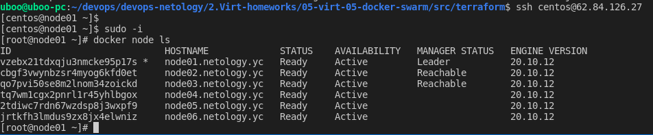
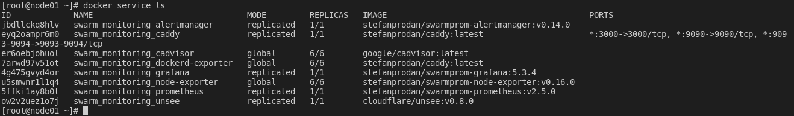
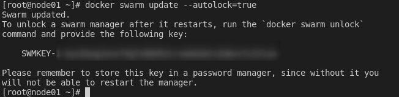

# Домашнее задание к занятию "5.5. Оркестрация кластером Docker контейнеров на примере Docker Swarm"

## Как сдавать задания

Обязательными к выполнению являются задачи без указания звездочки. Их выполнение необходимо для получения зачета и диплома о профессиональной переподготовке.

Задачи со звездочкой (*) являются дополнительными задачами и/или задачами повышенной сложности. Они не являются обязательными к выполнению, но помогут вам глубже понять тему.

Домашнее задание выполните в файле readme.md в github репозитории. В личном кабинете отправьте на проверку ссылку на .md-файл в вашем репозитории.

Любые вопросы по решению задач задавайте в чате учебной группы.

---

## Задача 1

Дайте письменые ответы на следующие вопросы:

- В чём отличие режимов работы сервисов в Docker Swarm кластере: replication и global?
- Какой алгоритм выбора лидера используется в Docker Swarm кластере?
- Что такое Overlay Network?

### Ответ:

1. Для replication сервиса вы указываете, сколько идентичных задач хотите запустить. Например, вы решили развернуть сервис HTTP с тремя репликами, каждая из которых обслуживает один и тот же контент.

Global сервис — это сервис, который запускает одну задачу на каждой ноде. Предварительно заданного количества задач нет. Каждый раз, когда вы добавляете ноду в swarm, оркестратор создает задачу, а планировщик назначает задачу новой ноде. По официальной документации, хорошими кандидатами на роль глобальных сервисов являются агенты мониторинга, антивирусные сканеры или другие типы контейнеров, которые вы хотите запустить на каждой ноде в swarm.

2. Для выбора лидера используется алгоритм поддержания распределенного консенсуса — Raft.

3. Overlay-сети используются в контексте кластеров (Docker Swarm), где виртуальная сеть, которую используют контейнеры, связывает несколько физических хостов, на которых запущен Docker. Распределенная сеть между множественными хостами Docker для использования сервисами.

## Задача 2

Создать ваш первый Docker Swarm кластер в Яндекс.Облаке

Для получения зачета, вам необходимо предоставить скриншот из терминала (консоли), с выводом команды:
```
docker node ls
```
### Ответ:
```
packer validate centos-7-base.json
packer build centos-7-base.json
terraform init
terraform validate
terraform plan
terraform apply -auto-approve
```
<p align="center">
  
</p>

## Задача 3

Создать ваш первый, готовый к боевой эксплуатации кластер мониторинга, состоящий из стека микросервисов.

Для получения зачета, вам необходимо предоставить скриншот из терминала (консоли), с выводом команды:
```
docker service ls
```
### Ответ:

<p align="center">
  
</p>

## Задача 4 (*)

Выполнить на лидере Docker Swarm кластера команду (указанную ниже) и дать письменное описание её функционала, что она делает и зачем она нужна:
```
# см.документацию: https://docs.docker.com/engine/swarm/swarm_manager_locking/
docker swarm update --autolock=true
```
### Ответ:

Это шифрование в состоянии покоя защищает конфигурацию и данные вашего сервиса от злоумышленников, которые получают доступ к зашифрованным журналам Raft.

<p align="center">
  
</p>

```
#удаляем все
terraform destroy -auto-approve
```
