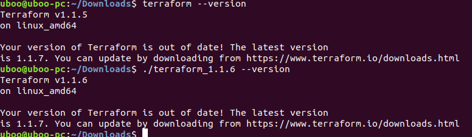

# Домашнее задание к занятию "7.1. Инфраструктура как код"

## Задача 1. Выбор инструментов. 
<details><summary>Легенда</summary> 
Через час совещание на котором менеджер расскажет о новом проекте. Начать работу над которым надо 
будет уже сегодня. 
На данный момент известно, что это будет сервис, который ваша компания будет предоставлять внешним заказчикам.
Первое время, скорее всего, будет один внешний клиент, со временем внешних клиентов станет больше.

Так же по разговорам в компании есть вероятность, что техническое задание еще не четкое, что приведет к большому
количеству небольших релизов, тестирований интеграций, откатов, доработок, то есть скучно не будет.  
   
Вам, как девопс инженеру, будет необходимо принять решение об инструментах для организации инфраструктуры.
На данный момент в вашей компании уже используются следующие инструменты: 
- остатки Сloud Formation, 
- некоторые образы сделаны при помощи Packer,
- год назад начали активно использовать Terraform, 
- разработчики привыкли использовать Docker, 
- уже есть большая база Kubernetes конфигураций, 
- для автоматизации процессов используется Teamcity, 
- также есть совсем немного Ansible скриптов, 
- и ряд bash скриптов для упрощения рутинных задач.  

Для этого в рамках совещания надо будет выяснить подробности о проекте, что бы в итоге определиться с инструментами:

1. Какой тип инфраструктуры будем использовать для этого проекта: изменяемый или не изменяемый?
1. Будет ли центральный сервер для управления инфраструктурой?
1. Будут ли агенты на серверах?
1. Будут ли использованы средства для управления конфигурацией или инициализации ресурсов? 
 
В связи с тем, что проект стартует уже сегодня, в рамках совещания надо будет определиться со всеми этими вопросами.

### В результате задачи необходимо

1. Ответить на четыре вопроса представленных в разделе "Легенда". 
1. Какие инструменты из уже используемых вы хотели бы использовать для нового проекта? 
1. Хотите ли рассмотреть возможность внедрения новых инструментов для этого проекта? 

Если для ответа на эти вопросы недостаточно информации, то напишите какие моменты уточните на совещании.
</details>

### Ответ 1:
- Ответить на четыре вопроса представленных в разделе "Легенда": <br />
1. Какой тип инфраструктуры будем использовать для этого проекта: изменяемый или не изменяемый?
Для начала проекта можно выбрать изменяемый ansible + terraform. В дальнейшем уже перейти на неимзеняемый packer + terraform, когда будет более понятно с готовой инфраструктурой. 

2. Будет ли центральный сервер для управления инфраструктурой? <br />
Мы будем использовать Terraform без центрального сервера, так как уже год используем его. Весь сервис будет в облаке для быстрого масштабирования.

3. Будут ли агенты на серверах? <br />
Terraform и Ansible не требуют установки никаких дополнительных агентов.

4. Будут ли использованы средства для управления конфигурацией или инициализации ресурсов? <br />
Управление конфигурацие будем через Ansible. Инициализация через Terraform.

- Какие инструменты из уже используемых вы хотели бы использовать для нового проекта?  <br />
Packer, Terraform, Docker, Ansible. Kubernetes можно использовать в будущем, на первом этапе он не нужен.
Активно используется уже год Terraform, нам пригодится для взаимодействия с облачным провайдером. Разработчики привыкли использовать Docker. Так что будем использовать их. Packer будем использовать для написание образов и Ansible для придание .

- Хотите ли рассмотреть возможность внедрения новых инструментов для этого проекта?  <br />
Когда сервисы разрастуся и контейнеров на докере станет много, можно запустить оркестрацию на Kubernetes.

## Задача 2. Установка терраформ. 

Официальный сайт: https://www.terraform.io/

Установите терраформ при помощи менеджера пакетов используемого в вашей операционной системе.
В виде результата этой задачи приложите вывод команды `terraform --version`.

### Ответ 2:
```
terraform --version
    Terraform v1.1.5
    on linux_amd64
```
## Задача 3. Поддержка легаси кода. 

В какой-то момент вы обновили терраформ до новой версии, например с 0.12 до 0.13. 
А код одного из проектов настолько устарел, что не может работать с версией 0.13. 
В связи с этим необходимо сделать так, чтобы вы могли одновременно использовать последнюю версию терраформа установленную при помощи
штатного менеджера пакетов и устаревшую версию 0.12. 

В виде результата этой задачи приложите вывод `--version` двух версий терраформа доступных на вашем компьютере 
или виртуальной машине.

### Ответ 3:

Так как для России заблокировали hashicorp сервера. [Воспользуемся Зеркалом](https://hashicorp-releases.website.yandexcloud.net/terraform/)

```
wget https://hashicorp-releases.website.yandexcloud.net/terraform/1.1.6/terraform_1.1.6_linux_amd64.zip

~/Downloads$ ./terraform_1.1.6 --version
Terraform v1.1.6
on linux_amd64
```
<p align="center">
  
</p>

---

### Как cдавать задание

Выполненное домашнее задание пришлите ссылкой на .md-файл в вашем репозитории.

---
